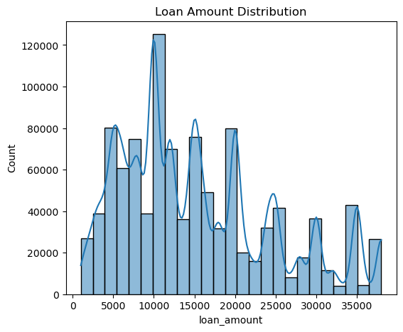
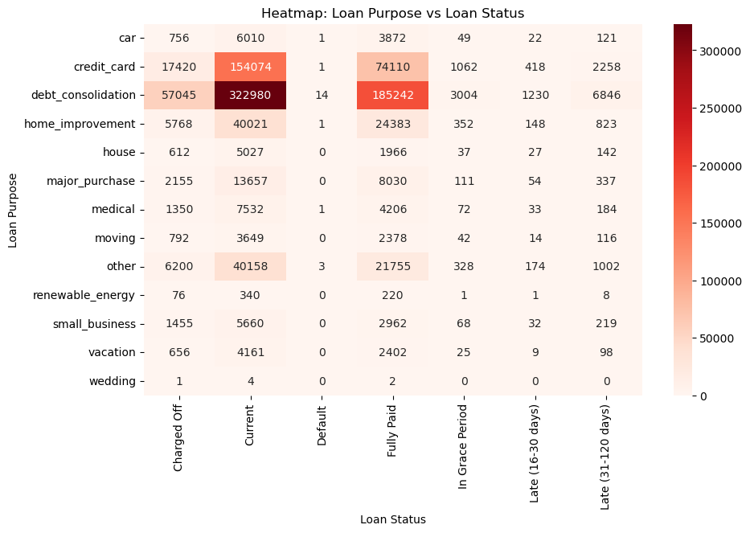

# Exploratory Data Analysis of BNPL User Behavior & Repayment Risk

## 📌 Project Overview
This project performs end-to-end Exploratory Data Analysis (EDA) on a large-scale Buy Now Pay Later (BNPL) dataset to identify borrower characteristics and loan attributes associated with higher repayment risk.

The analysis focuses on understanding **repayment behavior**, **risk signals**, and **segment-level patterns** relevant to credit underwriting and risk policy decisions.

---

## 🎯 Objectives
- Analyze distributions of key financial and behavioral variables
- Examine relationships between borrower attributes and loan outcomes
- Identify high-risk segments based on purpose, housing status, and pricing
- Create a clean, analysis-ready dataset with documented assumptions
- Derive actionable insights for BNPL risk strategy

---

## 📂 Dataset Details
- **Source:** Kaggle – BNPL Dataset (v1)
- **Records:** ~1,048,000
- **Features:** 29 (16 numerical, 13 categorical)
- **Target Variable:** `loan_status`  
  (Current, Fully Paid, Charged Off, Default, Late, etc.)
  
  > Dataset is sourced from Kaggle and is subject to its original license and usage terms.

## 📂 Dataset Access
Due to GitHub file size limits, the dataset is **not included** in this repository.

🔗 **Dataset Source:**  
Kaggle – BNPL Dataset (v1)  
https://www.kaggle.com/datasets/bdoey1/bnpl-data-v1

### How to use:
1. Download the dataset from Kaggle
2. Place the CSV file inside the `data/` folder
3. Run the notebook normally

---

### Key Features
- Financial: `loan_amount`, `interest_rate`, `monthly_payment`
- Credit Profile: `annual_income`, `total_dti`, `credit_limit`
- Behavior: `delinq_2yrs`, `num_accts_120_pd`, `mort_acc`
- Segmentation: `loan_purpose`, `home_ownership`, `application_type`

---

## 🧹 Data Cleaning & Preparation
- Parsed text-based fields (loan term, employment length)
- Median imputation for missing numerical values
- Dropped high-missing columns (e.g., `emp_title`)
- IQR-based outlier capping for financial stability
- Validated data types and removed inconsistencies

---

## 📊 Analysis Performed
### ✔ Univariate Analysis
- Distribution of loan status (class imbalance observed)
- Numerical distributions before & after outlier treatment
- Categorical breakdowns (purpose, housing, application type)

### ✔ Bivariate Analysis
- Numerical vs numerical (income vs loan amount, payment vs term)
- Categorical vs numerical (loan amount & interest rate by loan status)
- Categorical vs categorical (purpose & housing vs loan outcomes)

### ✔ Multivariate Analysis
- Parallel coordinate plots
- Interaction between income, loan size, interest rate, and outcomes
- Segment-level risk concentration analysis

### ✔ Pivot Table Insights
- Charge-off rates by home ownership
- Risk concentration across loan purposes
- Segment-level volume vs risk trade-offs

---

## 🔍 Key Insights
- **Higher interest rates** cluster with adverse loan outcomes
- **Debt consolidation & credit card loans** show elevated risk by volume
- **Renters** exhibit higher charge-off rates than mortgage holders
- Income alone is insufficient—**multivariate interactions** matter
- Outlier treatment improved distribution quality without biasing medians

---
## 📊 Key Visual Insights
### Loan Amount Distribution

### Loan Amount vs Loan Status

### Loan Purpose vs Repayment Risk

> Visuals are generated from the full dataset and represent portfolio-level risk patterns.
> Additional exploratory plots are available in the `/visuals` directory.

---

## 🛠 Tools & Technologies
- Python
- Pandas, NumPy
- Matplotlib, Seaborn
- Jupyter Notebook

---

## 👤 Author
**Teja Kesarapu**  
Data Analyst | Python | SQL | Power BI | FinTech Analytics
